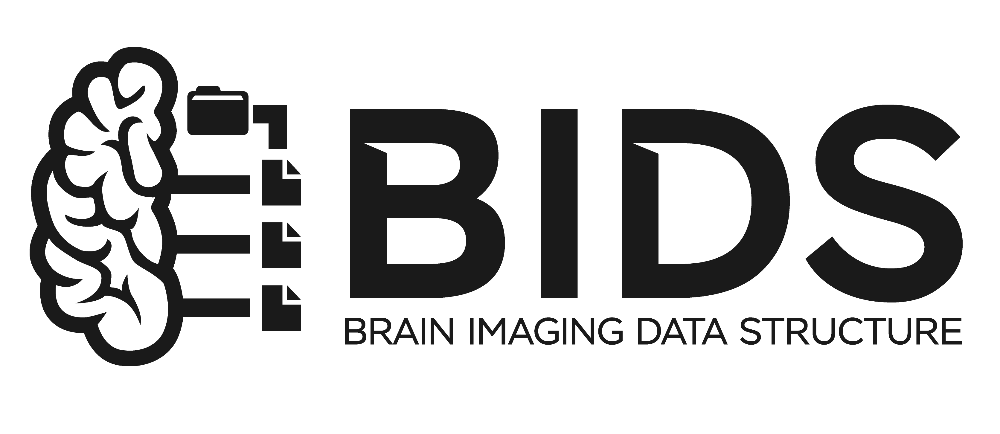

# BIDS Converter for EEG

Converts raw EEG datasets into spec-valid [BIDS](https://bids.neuroimaging.io/) datasets. Supports EDF, BrainVision, EEGLAB `.set`, Biosemi BDF, GDF, CNT, Curry `.cdt`, MATLAB `.mat`, and any format MNE can read.

<!-- BIDS logo: https://bids.neuroimaging.io/ -->
<p align="center">
  <a href="https://bids.neuroimaging.io/">
    <picture>
      <source media="(prefers-color-scheme: dark)" srcset="assets/BIDS_Logo_light.png">
      
    </picture>
  </a>
</p>

## Requirements

- **Recommended:** [uv](https://docs.astral.sh/uv/). Each script carries its dependencies as [PEP 723](https://peps.python.org/pep-0723/) metadata, so `uv run` handles installation automatically.
- **Alternative:** Python 3.10+ with manual install:

  ```bash
  pip install "mne>=1.6" "mne-bids>=0.14" "pybv>=0.7.3" \
              pandas openpyxl edfio eeglabio curryreader bids-validator-deno
  ```

## Installation

- **Download from release:** Download `eeg-bids-converter.zip` from [Releases](https://github.com/iatosh/eeg-bids-converter/releases), extract, and place in your skills directory.

- **Clone this repo:**

  ```bash
  git clone https://github.com/iatosh/eeg-bids-converter.git
  ```

  Place the folder in your agent's skills directory.

## Usage

Invoke the `eeg-bids-converter` skill in your agent.

## How It Works

| Step | Script | What It Does |
|------|--------|-------------|
| 1. Survey | `inspect_dataset.py` | List files, check readability, read documentation |
| 2. Map entities | `inspect_dataset.py --pattern` | Extract subject, session, task, run, acq from filenames |
| 3. Collect metadata | interactive | `PowerLineFrequency`, `EEGReference`, `EEGGround`, `Manufacturer`, event codes, electrode provenance, license, citation |
| 4. Convert | `convert_recording.py` | One call per recording; verify sampling rate, duration, waveform; convert non-standard formats to BrainVision |
| 5. Patch sidecars | `patch_sidecar.py` | Write fields `mne-bids` cannot infer; fix `Manufacturer` misattribution |
| 6. Metadata & validate | `write_bids_metadata.py`, `validate_bids.py` | Generate `dataset_description.json`, `participants.tsv`, `README`, `CHANGES`; run official validator and key-spelling check |
| 7. Report | — | Conversion summary, validator output, judgment calls with sources |

## Agent Behavior

- **Never modifies the source dataset.** Repairs happen on scratch copies.
- **Records what the dataset says, not what looks complete.** A plausible guess is data corruption no validator will catch.
- **Asks before falling back to `"n/a"`.** Order: documentation, user, `"n/a"`.
- **Fixes root causes on validation failure.** Errors are never silenced.
- **Zero validator errors is necessary, not sufficient.** Structure is correct; content is verified by read-back and the final report.

## Situational References

| File | When Used |
|------|-----------|
| `custom_formats.md` | MNE cannot open the file |
| `events.md` | Events not in `raw.annotations`; trigger code documentation |
| `electrodes.md` | Electrode positions and `--montage` |
| `derivatives.md` | Source ships pre-filtered copies |
| `bids_reference.md` | BIDS spec facts |
| `templates_and_examples.md` | Finished metadata file examples |

## License

MIT. See [LICENSE](LICENSE).

BIDS logo is (c) BIDS community: <https://bids.neuroimaging.io/>.
